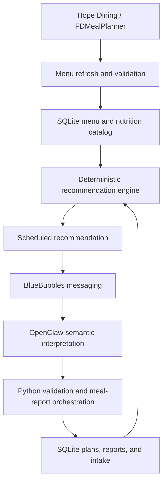

# Nutrition_Optimizer

Nutrition_Optimizer is a personal dining recommendation and meal-reporting system built around Hope College dining data. It turns published menus and nutrition facts into meal suggestions, accepts conversational reports of what was eaten, and keeps a durable daily intake record. Language models help interpret wording; deterministic Python validates food, quantities, and all nutrition arithmetic.

## What it does

- Refreshes a local SQLite cache of Hope Dining menus and official FDMealPlanner nutrition facts.
- Schedules breakfast, lunch, dinner, or Sunday brunch recommendations when the dining calendar and current menu allow them.
- Sends recommendations and receives conversational meal reports through an optional BlueBubbles messaging integration.
- Shows human-friendly visual portions while retaining exact official-serving quantities for calculation and persistence.
- Tracks confirmed meals and shakes in actual daily nutrient totals.

## Why I built it

I wanted a practical way to make consistent eating easier around a changing campus menu. The project also explores how meal timing and nutrition planning can reduce decision friction and support day-to-day energy and focus.

## Architecture



The local catalog is the source for menu eligibility and official nutrition snapshots. The optimizer computes a meal from configured targets and authoritative intake, then persists the plan before delivery.

For an incoming report, Nutrition_Optimizer prepares a bounded task, meal context, and response schema. OpenClaw invokes a configurable semantic model, which returns a structured interpretation; the deterministic boundaries do not depend on a particular model. Deterministic Python validates food identity, menu eligibility, and authoritative quantities before calculating nutrition and writing intake. Python owns targets, recommendation logic, and persisted application state. **The LLM interprets; Python decides what is valid and what gets recorded.** This lets users report meals conversationally while keeping nutrition calculations and state changes under explicit, testable rules.

## Key engineering decisions

- **Fail-closed interpretation:** unsupported or ambiguous meal reports trigger clarification instead of silently creating intake.
- **Exact quantity versus presentation:** nutrition calculations use authoritative serving quantities, while visual portion descriptions help users judge portions and remain presentation-only unless they have a validated reversible mapping to those quantities.
- **Independent meal contexts:** plans and report drafts are scoped to a specific date, meal, and chat so one meal's report cannot accidentally modify another.
- **Separate shake accounting:** confirmed shakes count toward actual daily nutrition totals, but are excluded from meal recommendation calculations so drinking a shake does not shrink later meals and skipping one does not enlarge them.
- **Durable delivery and reporting:** persisted plans, dispatch records, source message IDs, and report applications help prevent duplicate intake and preserve report state across retries.

## Example workflow

1. A breakfast timer uses the current menu and configured targets to recommend a meal, such as eggs, oatmeal, and fruit.
2. The user replies, “I ate the eggs and half the oatmeal; I skipped the fruit.”
3. The semantic layer proposes the foods and quantities expressed in that message.
4. Python validates each proposal against the active breakfast plan and official serving definitions, then asks for clarification if anything remains uncertain.
5. An accepted report is persisted once. Later recommendations use authoritative meal intake; actual daily totals also include any separately confirmed shake intake.

This example is synthetic; no personal messages or contacts are included in the repository.

## Tech stack

Python 3.12+, SQLite, systemd timers for the personal deployment, FDMealPlanner as the primary menu source, OpenClaw for semantic interpretation, and BlueBubbles for messaging. The older DiningBucket ingestion code remains available as a secondary data path; it is not the primary production menu source.

## Local development

A fresh clone can run the core tests and initialize an empty database without BlueBubbles, OpenClaw, or a personal server. From the repository root:

```sh
python3 -m venv .venv
.venv/bin/python -m pip install -e .
.venv/bin/python -c 'from nutrition_optimizer.fdmealplanner.catalog import OfficialNutritionCatalog; OfficialNutritionCatalog().close()'
.venv/bin/python -m unittest discover -s tests
```

The database command creates `data/state/nutrition.sqlite3` and applies the current schema (v14); it does not download menus. The database and downloaded menus are local runtime data ignored by Git. To inspect the public menu refresh command without writing state, run `.venv/bin/python -m nutrition_optimizer.fdmealplanner.menu_cache --help`. A real refresh uses `refresh-menu-cache` and makes requests to FDMealPlanner; it requires the upstream service to be available.

The tests use local fixtures and mocks rather than a live dining or messaging service. Coverage includes migrations, recommendation logic, meal and report lifecycle, semantic authority boundaries, portion presentation, shake intake, and persistence. In a fresh isolated environment for this release: **736 tests ran, 1 skipped, 0 failures**. The skipped test needs a populated local Phelps catalog; it is optional and never modifies that original database.

## Optional messaging deployment

The local core needs no environment file. For the BlueBubbles/OpenClaw integration, copy `.env.example` to a private `.env`, replace the example values, and load it into the service environment. The example file is documentation; Python does not automatically read it. The integration requires a reachable BlueBubbles server, the selected chat or sender filter, a local OpenClaw CLI and configured gateway, and explicit daily targets. The OpenClaw executable path can be supplied through `NUTRITION_OPTIMIZER_OPENCLAW_PATH`; its source default reflects the original personal host. An unused optional OpenAI API interpreter also exists, but the current messaging receiver uses OpenClaw.

The files in `systemd/` are deployment examples using `/opt/nutrition-optimizer` and a dedicated service account. Adjust paths, account, environment-file location, and any network tunnel dependencies for your host before installing them. They are not needed to develop or test the project. Do not commit a populated `.env`, runtime database, conversation log, or service credential.

## Project status

Completed V1 personal production project. Nutrition_Optimizer is deployed for one personal workflow and demonstrates a working end-to-end system with tested authority boundaries.
